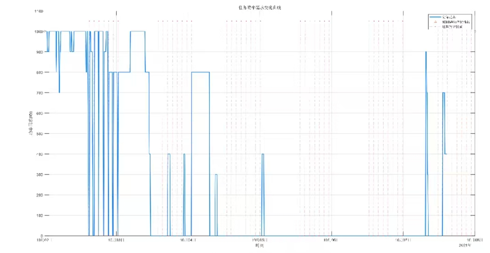
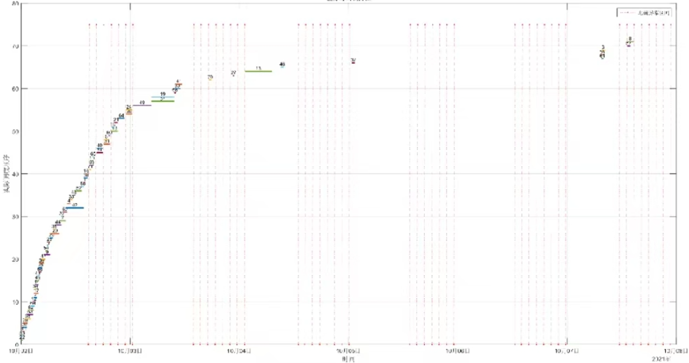
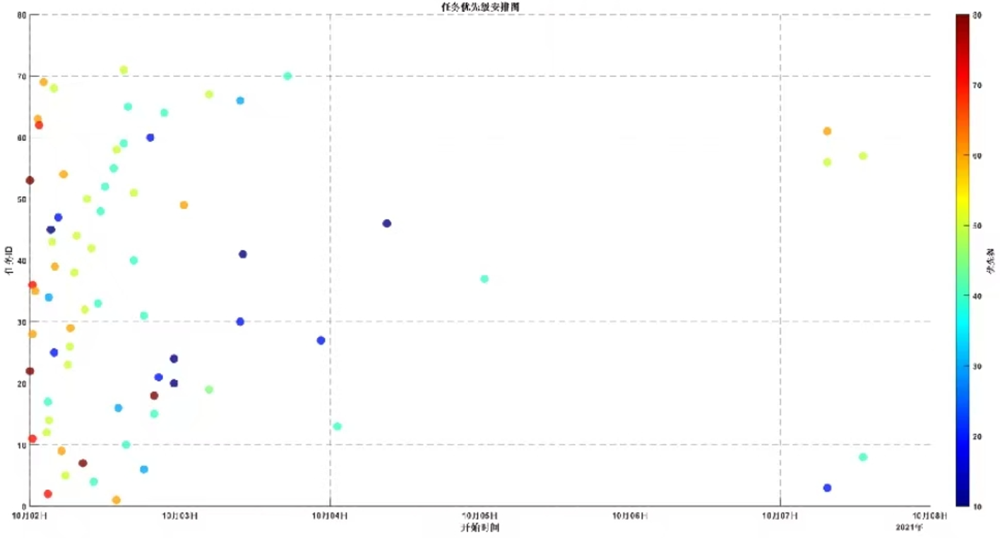

# 作业三

## 快速开始

本项目使用 [uv](https://docs.astral.sh/uv/) 管理 Python 依赖，需要 Python >= 3.12。

```bash
uv sync                # 安装依赖（自动创建 .venv）
uv run python main.py  # 运行调度程序
```

运行结束后，`output/` 目录下会生成：

- `schedule.csv` — 任务安排表（BJT 时间、任务 ID、持续时间、优先级）
- `power_chart.png` — 总功率随时间变化曲线（含 1000W 上限参考线）
- `timeline_chart.png` — 任务甘特图（按开始时间排列，颜色映射优先级）
- `priority_chart.png` — 按优先级分色的功率堆叠柱状图

## 项目结构

```text
Planning/
├── main.py                # 入口脚本（设置 PYTHONPATH 后调用 python/main.py）
├── pyproject.toml         # 项目依赖（numpy, scipy, matplotlib, openpyxl, pytest）
├── python/
│   ├── main.py            # 主流程：调度 → 约束验证 → 生成图表与 CSV
│   ├── src/
│   │   ├── models.py      # Task 数据类（frozen dataclass）
│   │   ├── scheduler.py   # 贪心调度核心（优先级降序 + PowerTracker）
│   │   ├── solar_angle.py # 三次样条阳光角插值模型（scipy CubicSpline）
│   │   ├── data_io.py     # CSV 数据读取与解析（按表头自动发现文件）
│   │   ├── plot.py        # 图表生成（功率图、甘特图、优先级堆叠图）
│   │   ├── power_check.py # 功率约束检查（事件驱动扫描算法）
│   │   ├── JudgeAvoidAreaClash.py  # 地磁异常区约束验证
│   │   ├── JudgeSolarClash.py      # 阳光角约束验证
│   │   └── JudgeWelecClash.py      # 功率约束验证（调用 power_check）
│   └── tests/
│       ├── conftest.py            # 测试路径配置
│       └── test_converted_matlab.py  # 约束检查与数据读取单元测试
├── matlab/                 # 原始 MATLAB 实现（参考）
├── data/                   # 输入数据
│   ├── event.csv / event.xlsx              # 任务列表
│   ├── AvoidAeraWindow.csv                 # 地磁异常区时间窗口
│   ├── SolarAngle.csv                      # 轨道阳光角采样
│   └── planningevents.csv / planningevents.xlsx
├── output/                 # 程序生成的调度结果（gitignored）
└── figures/                # 实验要求中的参考图
```

**程序流程：** `main.py` → `scheduler.py` 按优先级降序贪心安排任务（逐分钟扫描，满足异常区避让、阳光角范围、功率上限三重约束） → 三类约束验证 → 输出 CSV 与 PNG 图表到 `output/`

## 实验目的

通过本实验，使学员学会进行简单航天任务规划的能力，加深对地面系统及飞行任务运营的理解，达到培养学员自己动手、分析解决实际问题的能力。

## 实验内容

将给定的空间站在轨任务列表，在时间轴上进行安排，要求满足最大功率、轨道阳光角约束，并避开地磁异常特殊地区等。

## 输入

> 详见 `data` 文件夹中的 `csv` 或 `xlsx` 文件。

本项目以 `data/event.xlsx` 作为任务列表的可执行数据源；同目录下的
`event.csv` 是该 Excel 数据的文本副本。异常区窗口和阳光角数据分别
来自 `data/AvoidAeraWindow.csv` 和 `data/SolarAngle.csv`，程序通过
表头自动发现对应文件。若课程 PDF 中的表格与 `event.xlsx` 存在个别
差异，调度程序和报告均按 `event.xlsx` 计算。

待安排空间站在轨任务列表（部分）：

| ID | 任务时长 (min) | 电能 (W) | 最小阳光角 (deg) | 最大阳光角 (deg) | 优先级 |
|----|----------------|----------|------------------|------------------|--------|
| 1  | 20             | 200      | 0                | 21               | 60     |
| 2  | 40             | 300      | 0                | 23               | 70     |
| 3  | 51             | 300      | -23              | -1               | 20     |

## 约束条件

1. 所有在轨任务均需避开地磁异常区；
2. 阳光角通过三次样条插值计算（scipy CubicSpline），满足在约束范围内；
3. 在某一时刻电能消耗的上限为 1000W；
4. 编排时间窗口为 2021-10-02 到 2021-10-08。

### 空间站过地磁异常区时间（部分）

| 序号 | 开始时间 (BJT)      | 结束时间 (BJT)      | 持续时间 (min) |
|------|---------------------|---------------------|----------------|
| 1    | 2021-10-02 14:47    | 2021-10-02 14:59    | 12             |
| 2    | 2021-10-02 16:21    | 2021-10-02 16:34    | 13             |
| 3    | 2021-10-02 18:01    | 2021-10-02 18:10    | 9              |
| 4    | 2021-10-02 19:41    | 2021-10-02 19:51    | 10             |

### 空间站轨道阳光角

| 时间 (BJT)           | 轨道阳光角 (deg) |
|----------------------|------------------|
| 2021-10-02 08:00     | 22.0224          |
| 2021-10-03 08:00     | 17.7033          |
| 2021-10-04 08:00     | 13.2018          |
| 2021-10-05 08:00     | 8.57077          |
| 2021-10-06 08:00     | 3.78939          |
| 2021-10-07 08:00     | -1.10305         |
| 2021-10-08 08:00     | -6.00856         |

## 输出

### 各任务安排的开始时间

空间站在轨任务安排表（参考）：

| 开始时间 (BJT)          | 任务ID | 持续时间 (min) | 优先级 |
|-------------------------|--------|----------------|--------|
| 2021-10-02 00:00:00     | 22     | 25             | 80     |
| 2021-10-02 00:00:00     | 53     | 25             | 80     |
| 2021-10-02 00:25:00     | 11     | 25             | 70     |

### 图表输出

| 文件名 | 说明 |
|--------|------|
| `power_chart.png` | 总功率随时间变化曲线，红色虚线标注 1000W 上限 |
| `timeline_chart.png` | 甘特图，横轴为时间（小时），颜色映射任务优先级 |
| `priority_chart.png` | 按低/中/高三档优先级分色的功率堆叠柱状图 |

### 参考图（实验要求）







## 测试

```bash
uv run pytest python/tests/ -v
```

测试覆盖约束检查（异常区、阳光角、功率）、数据读取、以及 `PowerTracker` 与事件扫描算法的交叉验证。
