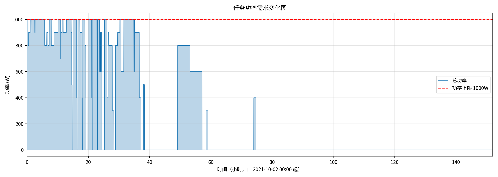
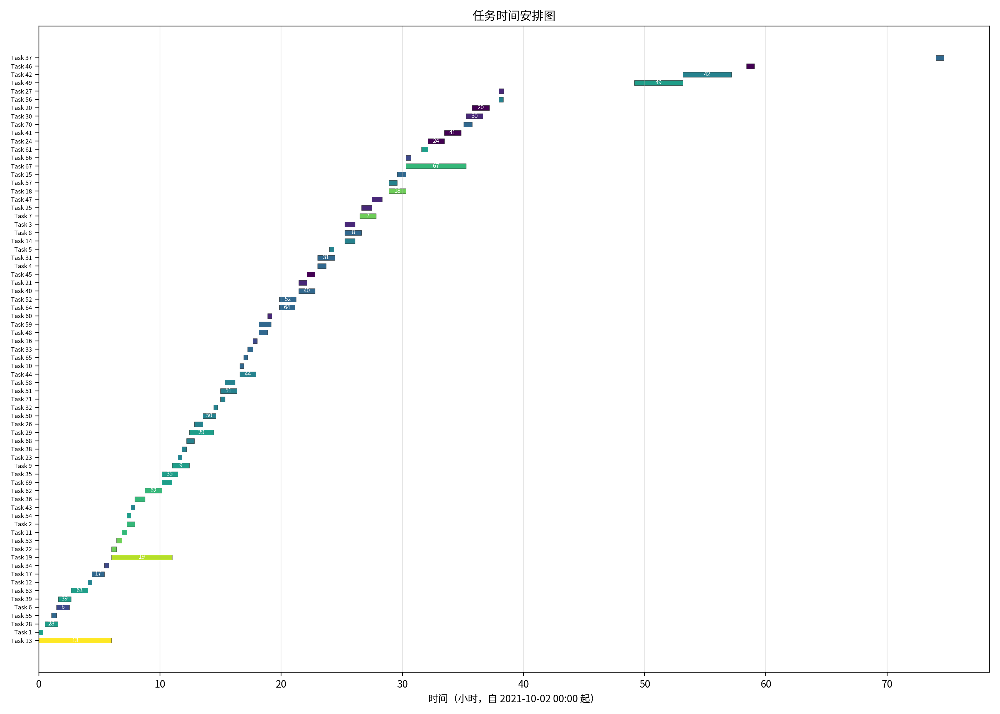
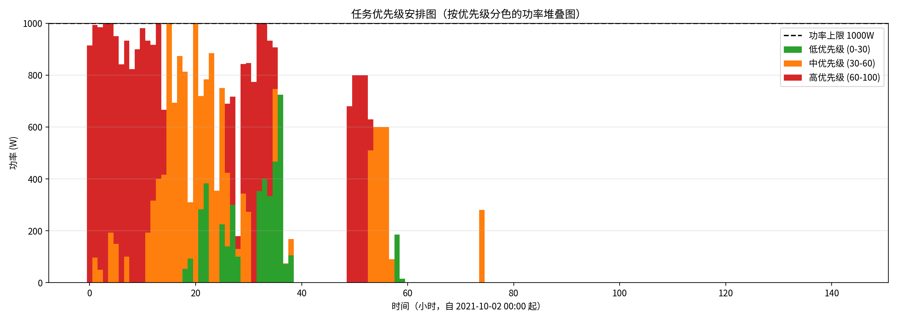

# 航天任务规划实验报告

## 一、实验目的

通过本实验，学会进行简单航天任务规划的能力，加深对地面系统及飞行任务运营的理解，达到培养自己动手、分析解决实际问题的能力。

## 二、实验内容

将给定的空间站在轨任务列表（共 71 项），在时间轴上进行安排，要求满足：
1. 所有任务避开地磁异常区；
2. 阳光角通过**三次多项式插值（三次样条）**计算，并满足约束范围；
3. 任意时刻电能消耗上限为 **1000W**；
4. 编排时间窗口为 **2021-10-02 至 2021-10-08**。

本报告以 `data/event.xlsx` 作为任务列表的可执行数据源；同目录下的
`event.csv` 为该 Excel 数据的文本副本。若课程 PDF 表格与 `event.xlsx`
存在个别差异，本文结果按 `event.xlsx` 计算。

## 三、算法说明

### 3.1 调度策略

采用**贪心算法**：
- 按任务**优先级降序**排序；
- 同优先级下优先安排**时长较短**的任务，以提高时间利用率；
- 对每个任务，从窗口起点开始以 **1 分钟**为步长搜索**最早可行**开始时间；
- 可行性同时检查：异常区避让、阳光角约束（三次样条插值）、功率上限。

### 3.2 阳光角插值

使用 `scipy.interpolate.CubicSpline` 对 8 个离散采样点进行**三次样条插值**，在任务区间内密集采样（200 点）判定是否全程满足角度约束。
任务表中的 `MinAngle` 与 `MaxAngle` 按有符号上下界直接解释，例如负角度区间只允许负阳光角。

### 3.3 功率检查

维护分钟粒度的功率时间线，在安排新任务时检查该任务覆盖的每一分钟内总功率是否超过 1000W。

## 四、实验结果

### 4.1 统计概览

| 指标 | 数值 |
|------|------|
| 总任务数 | 71 |
| 已安排任务数 | 71 |
| 未安排任务数 | 0 |
| 已安排总时长 | 78.2 小时 |
| 已安排总优先级 | 3320 |
| 未安排总优先级 | 0 |

### 4.2 任务安排表

| 任务ID | 开始时间(BJT) | 持续时间(min) | 优先级 | 功率(W) |
|--------|---------------|---------------|--------|---------|
| 13 | 2021-10-02 00:00:00 | 360 | 100 | 800 |
| 1 | 2021-10-02 00:00:00 | 20 | 60 | 200 |
| 28 | 2021-10-02 00:31:00 | 63 | 60 | 100 |
| 55 | 2021-10-02 01:02:00 | 25 | 40 | 100 |
| 6 | 2021-10-02 01:27:00 | 63 | 30 | 100 |
| 39 | 2021-10-02 01:36:00 | 63 | 60 | 100 |
| 63 | 2021-10-02 02:39:00 | 83 | 60 | 200 |
| 12 | 2021-10-02 04:02:00 | 20 | 50 | 200 |
| 17 | 2021-10-02 04:22:00 | 63 | 40 | 200 |
| 34 | 2021-10-02 05:25:00 | 20 | 30 | 200 |
| 19 | 2021-10-02 06:00:00 | 300 | 90 | 400 |
| 22 | 2021-10-02 06:00:00 | 25 | 80 | 400 |
| 53 | 2021-10-02 06:25:00 | 25 | 80 | 500 |
| 11 | 2021-10-02 06:50:00 | 25 | 70 | 400 |
| 2 | 2021-10-02 07:15:00 | 40 | 70 | 300 |
| 54 | 2021-10-02 07:15:00 | 20 | 60 | 300 |
| 43 | 2021-10-02 07:35:00 | 20 | 50 | 300 |
| 36 | 2021-10-02 07:55:00 | 51 | 70 | 400 |
| 62 | 2021-10-02 08:46:00 | 82 | 70 | 500 |
| 69 | 2021-10-02 10:08:00 | 51 | 60 | 300 |
| 35 | 2021-10-02 10:08:00 | 80 | 60 | 300 |
| 9 | 2021-10-02 11:00:00 | 85 | 60 | 600 |
| 23 | 2021-10-02 11:28:00 | 20 | 50 | 400 |
| 38 | 2021-10-02 11:48:00 | 22 | 50 | 300 |
| 68 | 2021-10-02 12:10:00 | 40 | 50 | 300 |
| 29 | 2021-10-02 12:25:00 | 120 | 60 | 600 |
| 26 | 2021-10-02 12:50:00 | 42 | 50 | 400 |
| 50 | 2021-10-02 13:32:00 | 63 | 50 | 400 |
| 32 | 2021-10-02 14:25:00 | 20 | 50 | 500 |
| 71 | 2021-10-02 14:59:00 | 22 | 50 | 600 |
| 51 | 2021-10-02 14:59:00 | 82 | 50 | 400 |
| 58 | 2021-10-02 15:21:00 | 51 | 50 | 600 |
| 44 | 2021-10-02 16:34:00 | 80 | 50 | 500 |
| 10 | 2021-10-02 16:34:00 | 20 | 40 | 500 |
| 65 | 2021-10-02 16:54:00 | 20 | 40 | 500 |
| 33 | 2021-10-02 17:14:00 | 25 | 40 | 400 |
| 16 | 2021-10-02 17:39:00 | 22 | 30 | 400 |
| 48 | 2021-10-02 18:10:00 | 42 | 40 | 600 |
| 59 | 2021-10-02 18:10:00 | 60 | 40 | 400 |
| 60 | 2021-10-02 18:52:00 | 22 | 20 | 400 |
| 64 | 2021-10-02 19:51:00 | 75 | 40 | 600 |
| 52 | 2021-10-02 19:51:00 | 83 | 40 | 400 |
| 40 | 2021-10-02 21:26:00 | 82 | 40 | 500 |
| 21 | 2021-10-02 21:26:00 | 40 | 20 | 500 |
| 45 | 2021-10-02 22:06:00 | 40 | 10 | 500 |
| 4 | 2021-10-02 23:00:00 | 42 | 40 | 400 |
| 31 | 2021-10-02 23:00:00 | 85 | 40 | 600 |
| 5 | 2021-10-02 23:59:00 | 22 | 50 | 300 |
| 14 | 2021-10-03 01:15:00 | 51 | 50 | 300 |
| 8 | 2021-10-03 01:15:00 | 83 | 40 | 400 |
| 3 | 2021-10-03 01:15:00 | 51 | 20 | 300 |
| 7 | 2021-10-03 02:28:00 | 82 | 80 | 500 |
| 25 | 2021-10-03 02:38:00 | 51 | 20 | 300 |
| 47 | 2021-10-03 03:29:00 | 51 | 20 | 300 |
| 18 | 2021-10-03 04:54:00 | 82 | 80 | 500 |
| 57 | 2021-10-03 04:54:00 | 40 | 50 | 300 |
| 15 | 2021-10-03 05:34:00 | 42 | 40 | 400 |
| 67 | 2021-10-03 06:16:00 | 300 | 70 | 600 |
| 66 | 2021-10-03 06:16:00 | 25 | 30 | 400 |
| 61 | 2021-10-03 07:34:00 | 33 | 60 | 400 |
| 24 | 2021-10-03 08:07:00 | 80 | 10 | 400 |
| 41 | 2021-10-03 09:27:00 | 83 | 10 | 400 |
| 70 | 2021-10-03 11:03:00 | 42 | 40 | 400 |
| 30 | 2021-10-03 11:16:00 | 83 | 20 | 500 |
| 20 | 2021-10-03 11:45:00 | 85 | 10 | 400 |
| 56 | 2021-10-03 13:59:00 | 20 | 50 | 200 |
| 27 | 2021-10-03 13:59:00 | 22 | 20 | 300 |
| 49 | 2021-10-04 01:09:00 | 240 | 60 | 800 |
| 42 | 2021-10-04 05:09:00 | 240 | 50 | 600 |
| 46 | 2021-10-04 10:23:00 | 40 | 10 | 300 |
| 37 | 2021-10-05 02:00:00 | 42 | 40 | 400 |

### 4.3 任务功率需求变化图

### 4.4 任务时间安排图

### 4.5 任务优先级安排图

## 五、约束验证

对生成的任务安排进行独立验证：

- **地磁异常区约束**：所有已安排任务均不与异常区窗口重叠。
- **阳光角约束**：所有已安排任务在其持续时间内，阳光角（三次样条插值）均落在允许区间内。
- **功率约束**：任意时刻总功率 ≤ 1000W。

## 六、心得体会

本次实验完成了从 MATLAB 约束检查代码到 Python 的迁移，并补充了缺失的调度算法、功率约束检查以及三次样条阳光角插值。通过贪心调度策略，在 6 天的时间窗口内成功安排了全部 71 个任务，同时满足全部三类约束。实验加深了对航天任务规划中多约束优化问题的理解，也锻炼了将数学模型（三次样条）与工程实现相结合的能力。
